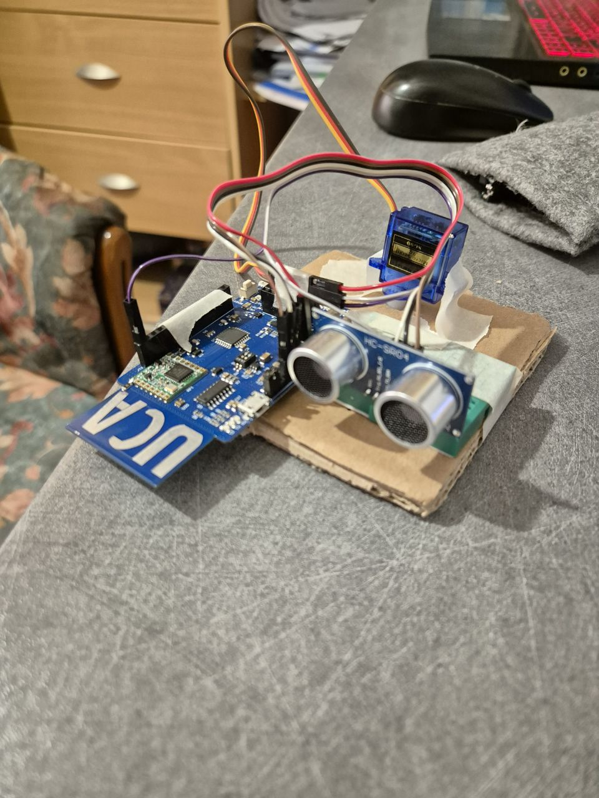
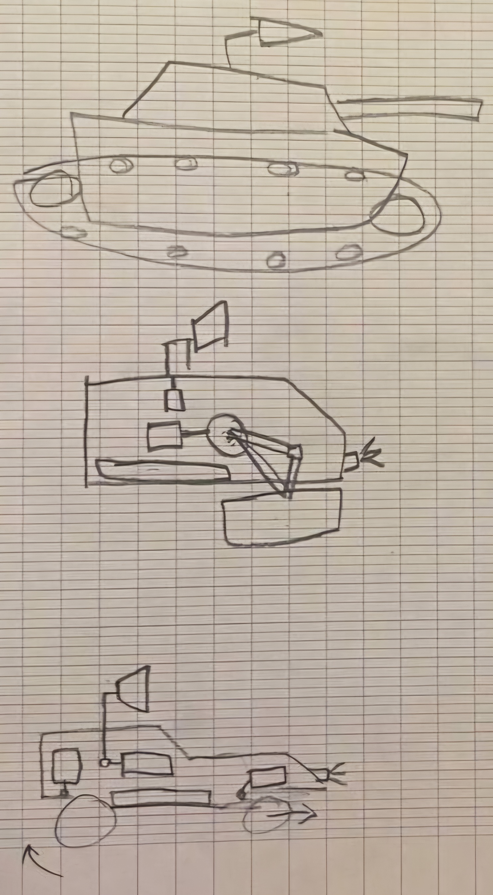

*Ce projet est réalisé dans le cadre du module Communication Sans Fil en Licence 1 à l’Université
Nice Sophia Antipolis*

---

# Projet - Radar de détection avec transmission LoRa

## Présentation

L’objectif principal était de créer un système capable de mesurer la distance à l’aide d’un capteur à ultrasons monté sur un servomoteur, et de transmettre les données via la connexion sans fil **LoRa** à une carte réceptrice, qui interprète ces données et affiche un retour visuel via des LED RGB.

---

## Idée initiale

Voici une visualisation générée par IA représentant l’idée de départ de notre projet :

---

## Objectifs

- Mesurer une distance dans une zone semi-circulaire grâce à un capteur à ultrasons fixé à un servomoteur.
- Transmettre les données à distance en utilisant LoRa.
- Interpréter les données reçues et réagir via des LEDs RGB (rouge = danger, vert = zone libre).
- Ajouter un système d’alerte (sirène) en cas de détection à courte distance.

---

## Matériel utilisé

- 2 cartes **Arduino UCA** avec modules LoRA.
- 1 **Servomoteur SG90**.
- 1 **Capteur à ultrasons HC-SR04**.
- 1 bande de **LEDs WS2812B**.
- Câblage de connexion, voiture RC, câbles d'alimentation, etc.

### Prototype du système :

---

## Variantes envisagées

L'idée de monter ce radar à une voiture RC n'est pas exhaustive. Différentes versions du projet ont été explorées avant d'arriver au design final :

---

## Schéma de fonctionnement

[Capteur ultrasons] --> [Arduino émetteur + Servomoteur] --> [LoRa] --> [LoRa] --> [Arduino récepteur] --> [LEDs + Alerte sonore]

---

## Code source

Le dossier `/code` contient les scripts pour les deux cartes :

- `sender.ino` – Mesure et envoie la distance.
- `receiver.ino` – Reçoit les données, affiche l’état via LED, déclenche une alarme.
- `radar_prototype.ino` - Code utilisé pendant la vérification du fonctionnement du prototype

---

## Documentation

### Version finale du projet :

- Le dossier `/doc` contient les cahiers de suivi individuels de chaque participant du projet

- Le dossier `/images` en contient la documentation visuelle de ce projet

- Le dossier `/presentation` contient la présentation, utilisée pour la soutenance de ce projet

---

## Améliorations possibles

À cause d'une désynchronisation apparante il est préférable de modifier les delais dans le code, ainsi que de simplifier les messages envoyés par LoRa, pour décharger un peu le cartes. Sinon on a créé un projet suffisamment intéressant et qui marche. Merci à l'équipe et au professeur de nous avoir donné cette possibilité.

---

## Auteurs

- Nikita ONEGIN
- Mykola MAKEDON
- Denys KARPOV
- Illia VEREMII
